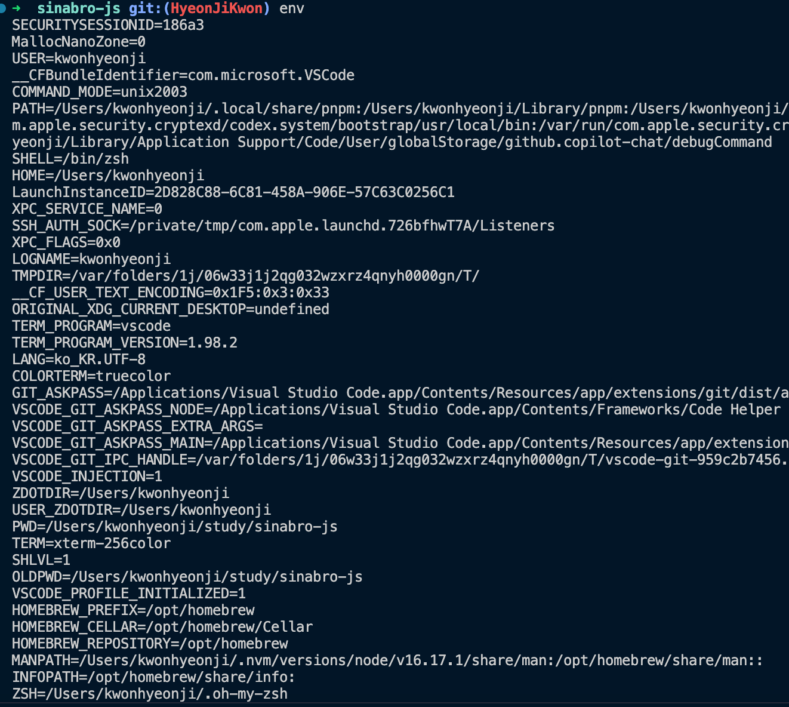

몰랐을 땐 주석인줄 알았어요.
하지만 새롭게 알게됨 .

### shebang
```javascript
// #! <interpreter> [optional-arg]
#!/usr/bin/env node
```

앞의 `#!`는 Byte 의 매직 넘버 (Magic Number): 이 파일이 어떤 명령어 해석기의 명령어 집합인지를 시스템에 알려주는 역할 (느낌표 뒤 공백 필수)

바로뒤는 경로명: 명령어들을 해석할 프로그램의 위치 알려줌.=> 절대 경로

뒤에는 해당 파일을 실행시켜주는 `인터프리터`(명령어 해석기) 위 예시 코드로 봤을 때 node.

---
#### 실제 작동 방식
	1.	쉘이 env를 /usr/bin/env에서 실행
	2.	env는 현재 환경변수 PATH를 뒤져서 node를 찾음
	3.	찾은 node로 파일 실행
---

### env
환경(environment)을 설정하거나, 환경에서 프로그램을 실행하는 유틸리티
command창에서 그냥 실행 시, 현재 설정된 모든 환경변수 보여줌.



•	node가 어디에 설치되어 있는지 정확히 몰라도, env가 현재 사용자의 PATH에서 알아서 찾아줌

•	그래서 다양한 환경에서 사용가능.

> 왜 	#!/usr/bin ?
>
> env는 보통 /usr/bin/env에 위치 (그래서 shebang에서 #!/usr/bin/env라고 씀)

