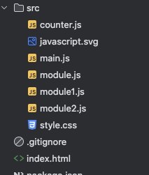
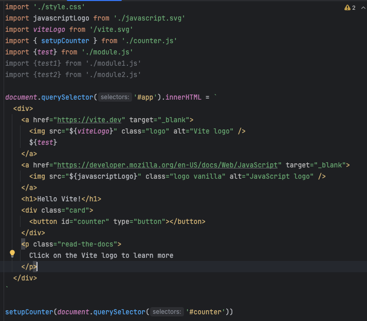
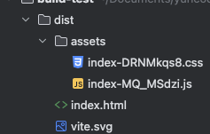
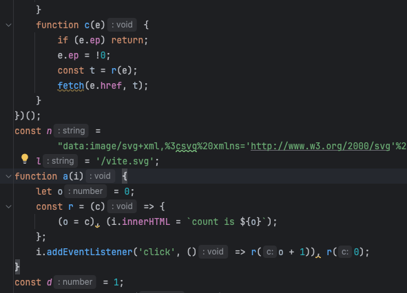

# 번들링은 어떤 문제를 해결하기 위해 나온건지 알아보기

강의 초반 번들러에 대한 설명이 나오는데 하나하나 개념이 부족한거 같아 작성해보겠슴다

---

먼저 파일들을 추가해보자.

추가한 파일들은 main.js에서 아래처럼 사용하고 있다.

이제 npm run build ( package.json > "scripts" > "build")를 실행해 보면 아래 처럼 dist 폴더가 생기면서 빌드된 파일들이 포함 되어 있다.

파일을 확인해보면 빌드를 하기전 파일들인 (module.js, counter.js 등) 스크립트 파일이 없어진걸 확인 할 수 있다.

우선 빌드된 index-{hash}를 확인해 보기전에 파일에 hash가 붙는 이유에 대해 간략하게 알아보자.

만약 브라우저가 현재 index-{hash} 파일을 캐싱을 했고, hash가 변경이 되지 않는다면 해당 파일 내용을 수정하고 배포를 했을때,
어떤 유저는 변경사항을 확인하고, 어떤 유저는 변경 전에 내용을 확인하게 될 것이다.

이 문제는 유저가 index-{hash} 요청시 브라우저가 변경하기 전 파일을 캐싱 하고 있거나 (변경사항이 반영 안된 유저),
반대로 캐싱이 안되어 있어 변경한 파일을 새로 요청해서이다.(변경사랑이 반영된 유저)
( 실무에서 이러한 문제가 생긴다면 먼저 캐싱 부터 확인해보자.. )

이러한 문제 해결을 위해 매번 다른 hash를 붙여 캐시 무효화(cache busting)을 한다는걸 알 수 있다.

자 그럼 사라진 파일들을 찾아 보자.

빌드된 index-{hash} 파일을 대충 흝어 보면 main.js의 구성이랑 크게 다르지 않다.
조금 더 자세히 보면 main.js에서 import로 가져온 값들이 a, d, n 등 다른 변수로 되어 있는걸 볼 수 있다.

변수에 뭐가 들었나 찾아보면 값은 import한 파일에서 export 했던 값인걸 확인 할 수 있다.

이것으로 우리는 대략적으로 번들링의 3가지의 동작을 확인해 볼 수 있다. 

1. 번들링(빌드)을 할때 import한 파일의 값을 미리 가져와 변수화를 한다.(Module Bundling)
2. 우리가 사용한 변수 네이밍이 아닌 a, b, n 등 간략해진 코드를 확인 할 수 있다.(Minification)
3. import를 했지만 사용하지 않은 module1.js, module2.js의 변수는 존재하지 않는다.(Tree Shaking)

그럼 왜 이렇게 설계가 되었을까? 바로 http 요청을 줄이고, 자원(코드)의 용량을 최적화 하기 위해서이다.

만약 번들링을 하지 않는 프로젝트 index.html에는 100개가 넘는 import, script, img 등등의 자원을 요청하는 태그와 5000줄이 넘는 코드가 있다 해보자.

브라우저는 화면을 그리기 위해 서버에 index.html을 요청 할것이고, 브라우저는 html을 읽으면서 필요한 100개가 넘는 자원들을 계속 요청을 할 것이다.
100개가 넘는 자원과 5000줄이 넘는 코드로 인해 파일 자체의 크기가 커지게 되어 다운로드 시간이 길어지고, 브라우저가 코드를 파싱하고 실행하는 데에도 추가 시간이 된다.

결국 이 문제는 네트워크 오버헤드, 서버 부하 성능 저하 등 사용자에게 치명적으로 다가온다. 

이러한 문제를 필요한 자원들을 미리 가져와 변수화(모듈 번들링)하고, 불필요한 코드를 삭제(트리 쉐이킹)하며, 코드 압축(미니피케이션)을 통해 하나의 파일 또는 작은 단위의 파일(예: 라우트 기준 등)로 해결 해주는것이다.