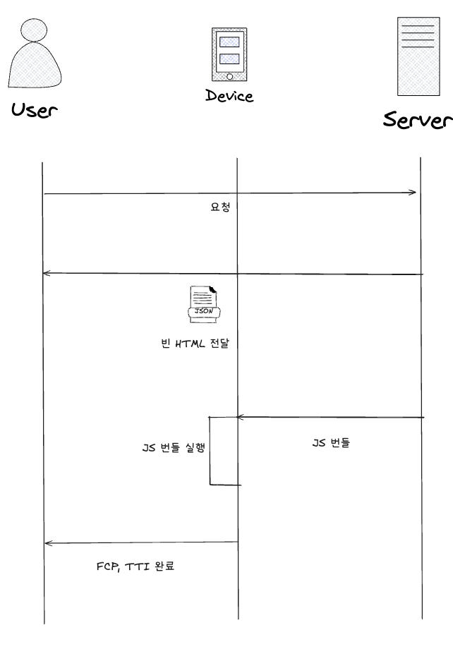
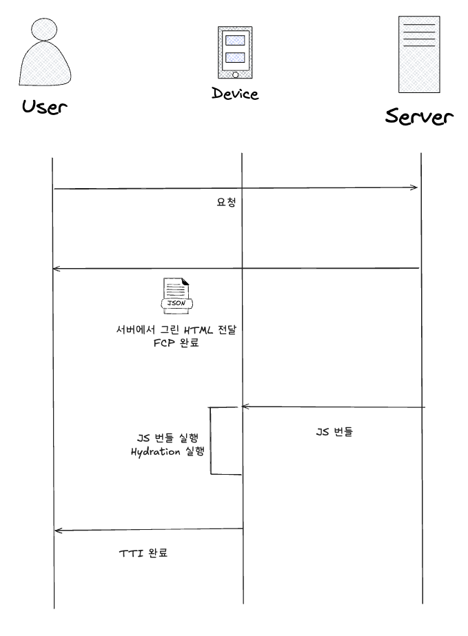

# Next.js Pre-rendering 이해해보기

Next.js에서는 Pre-rendering이라는 중요한 기능이 있다.

Pre-rendering은 말 그대로 서버에서 먼저 HTML을 그려준다는것을 말한다.

### 어떤 문제를 해결하려 했을까?

기존 React와 같은 SPA에서는 보통 빈 HTML을 서버에 요청을 받고, 번들링된 자바스크립트를 받아 브라우저에서 화면을 그려준다.
이것을 우리가 익숙하게 알고 있는 CSR 개념이다.

CSR의 동작 순서는 아래와 같다.
1. 유저가 페이지를 요청
2. 브라우저는 서버에 자원을 요청
3. 브라우저는 서버에게 빈 HTML을 받고 화면을 구성 (빈 화면)
4. 추가로 JS Bundle도 브라우저에 전달 (HTTP 통신이기에 1번씩 요청)
5. 브라우저에서 전달 받은 JS 실행
6. 유저에게 컨텐츠가 노출 (FCP, TTI 완료)
7. 이후 서버에 자원 요청 없이 사용 가능

위 동작 순서를 통해 확인해 보면 CSR에 대한 장점과 단점은 명확하다.

장점으로는 초기 요청 후에는 페이지 변환이나 동작이 빠른것이다. 그러한 이유는 이미 번들링된 JS를 통해 추가 서버에 요청 없이 화면을 그리기 때문이다.

반대로 단점은 초기 요청이 길어 FCP(First contentful paint)와 TTI(Time to Interactive)의 시간이 길고, 비어 있는 HTML을 요청 받기에 크롤러가 읽어갈 자료가 없어 SEO에도 취약점이 있다. (CSR도 크롤링이 가능하는 얘기가 있다.)

또한, JS 청크 파일이 크면 클 수록 랜더링하는 과정중 흰 화면(block time)이 노출될 수 있다.

Next.js는 이러한 CSR의 장단점을 모두 사용할 수 있게 Pre-rendering 도입하게 되었다.

## Pre-rendering

Pre-rendering의 동작 순서는 아래와 같다.
1. 유저가 페이지를 요청
2. 브라우저는 서버에 자원을 요청
3. 서버는 서버에서 JS를 실행 하여 HTML을 만들고 브라우저에게 전달
4. 브라우저는 받은 HTML을 통해 화면을 구성 (FCP 완료)
5. 추가로 JS Bundle도 브라우저에게 전달
6. 브라우저는 받은 JS Bundle과 이전 전달 받은 HTML에 Hydration을 진행 (TTI 완료)

위 동작 순서를 통해 확인해 보면 Pre-rendering은 CSR의 단점인 느린 FCP와 흰화면을 해결하고, 크롤러에게 전달할 컨텐츠도 생기된다.
또한, Hydration을 통해 서버에서 전달 받은 HTML을 그대로 사용하면서, 클라이언트에서 전달 받은 JS를 통해 동적인 화면을 그릴 수 있다.

이 과정을 통해 CSR의 단점을 보안하며 CSR의 장점을 사용할 수 있게 된다.

Next.js에서는 Pre-rendering을 두가지로 나누어 사용할 수 있다.

1. 정적 생성 (Static Generation)
2. 서버 사이드 렌더링 (Server Side Rendering)

두 종류의 차이는 HTML을 생성하는 시점에 있다.

### 정적 생성 (Static Generation)

정적 생성은 미리 HTML을 생성하여 브라우저에 전달하는 방식이다.

정적 생성은 빌드 시점에 HTML을 생성하고, 브라우저에 전달한다. 이후에는 브라우저에서 추가적인 요청이 없이 화면을 그릴 수 있다.

정적 생성은 빌드 시점에 HTML을 생성하기에 빌드 시간이 길어질 수 있지만, 브라우저에서는 빠르게 화면을 그릴 수 있다.

### 서버 사이드 렌더링 (Server Side Rendering)

서버 사이드 렌더링은 요청 시점에 HTML을 생성하여 브라우저에 전달하는 방식이다.

서버 사이드 렌더링은 요청 시점에 HTML을 생성하기에 빌드 시간은 빠르지만, 브라우저에서는 HTML을 받아 화면을 그린 후 추가적인 요청이 있을 수 있다.

### 서버컴포넌트와 SSR의 차이

Next.js 13 버전에서는 서버컴포넌트라는 기능이 추가되었다.

서버컴포넌트는 서버에서만 랜더링이 되는 컴포넌트이다.

여기서 말하는 랜더링은 HTML을 생성하는 것을 말한다.

SSR도 서버에서 HTML을 생성하는데 뭐가 다른걸까?에 대한 의문이 생길 수 있다.

차이점은 바로 HTML 응답 방식이다.

SSR은 서버 요청시 HTML을 전부 생성하고 SSG도 빌드 시점에 HTML을 전부 생성한다.

하지만 서버컴포넌트는 요청 시점에 서버에서만 렌더링하고, 클라이언트로는 “이미 HTML이 완성된 결과”만 전송하거나, RSC 프로토콜을 통해 필요한 조각만 스트리밍으로 전송한다.

또 하나의 큰 차이점은 서버컴포넌트는 Hydration 과정이 없다.

그 이유는 당연히 서버에서만 랜더링이 되어야 하기 때문에 Hydration 과정이 필요가 없는것이다.

우리는 서버컴포넌트를 개발 할때 이것이 강제된다는것을 알 수 있을 것이다.

' use server ' 키워드를 사용시 window, React Hooks 등 사용 할 수 없는 이유가 이것일것이다. 

또한, 클라이언트 쪽 번들에 해당 컴포넌트 로직이 포함되지 않으므로, 번들 크기를 줄이고 보안상 민감 로직을 숨길 수 있다.

## 참고

- [Next.js Pre-rendering](https://nextjs.org/docs/basic-features/pages)
- [Next.js Server Components](https://nextjs.org/docs/basic-features/pages)
- [Next.js Server Side Rendering](https://nextjs.org/docs/basic-features/pages)
- [Next.js Static Generation](https://nextjs.org/docs/basic-features/pages)
- [Next.js Data Fetching](https://nextjs.org/docs/basic-features/data-fetching)
- [Next.js Hydration](https://nextjs.org/docs/basic-features/data-fetching)
